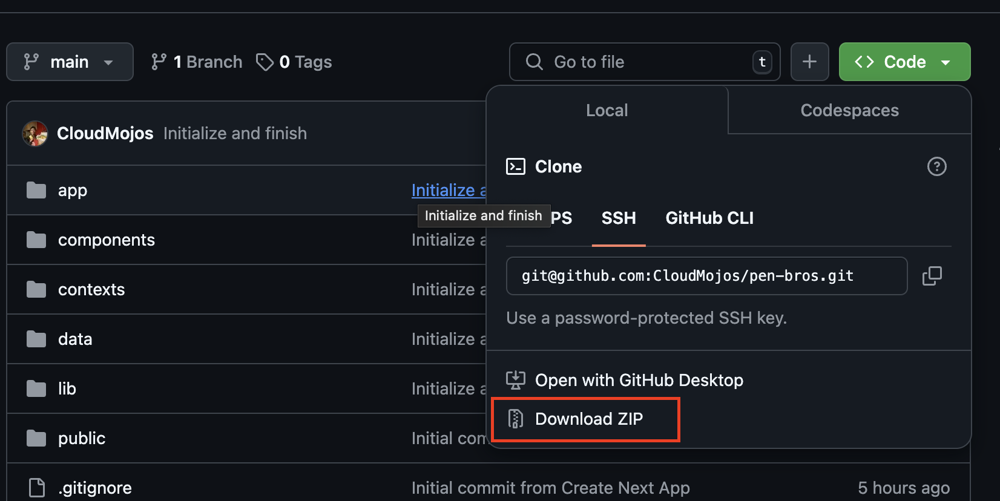

Node version 23.9.0
NPM version 10.9.2

### This project is made by Me using Next.js for PenBrothers. ;)

### Installation instructions:
1. Go to the [Github Repository](https://github.com/CloudMojos/pen-bros)
2. Download the zip file: 
(alternatively, you can run `git clone git@github.com:CloudMojos/pen-bros.git` or download the zip file from the provided [Google Drive link](https://drive.google.com/file/d/1xmTkHokBA2Di4SQ5aFe7t3QkP4W2bERK/view?usp=sharing).)
3. Open the terminal and change your current directory to the project.
4. Run `npm install` to install dependencies.
5. Run `npm run dev` to run the app locally.
6. Visit [localhost:3000](http://localhost:3000)

